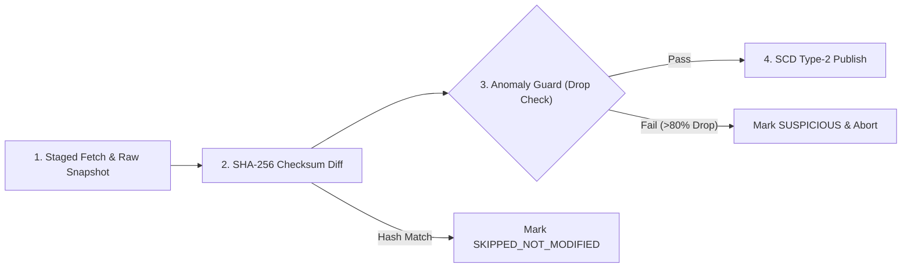

# TradeGuard Intelligence — Data Synchronization Engine Guide

## 1. Engine Purpose & Overview

The **Data Synchronization Engine** (`SyncEngineService` and `SyncSchedulerService`) is responsible for keeping the TradeGuard canonical database updated with official governmental and intergovernmental datasets while protecting downstream analysis from network outages, feed corruption, or upstream API rate limits.

---

## 2. Source Registry

The registry contains 9 pre-configured canonical intelligence sources:

| Source ID | Source Name | Category | Default Frequency | Upstream Endpoint |
| :--- | :--- | :--- | :--- | :--- |
| `OFAC_SDN` | US Treasury OFAC Specially Designated Nationals | `SANCTIONS` | 720 min (12h) | `https://sanctionslistservice.ofac.treas.gov/api/Publication/DownloadPublicationFile?fileName=SDN.XML` |
| `EU_FSF` | European Union Financial Sanctions Files | `SANCTIONS` | 720 min (12h) | `https://webgate.ec.europa.eu/europeaid/fsd/fsf/public/files/xmlFullSanctionsList_1_1/content` |
| `UK_OFSI` | UK HM Treasury Office of Financial Sanctions | `SANCTIONS` | 720 min (12h) | `https://ofsistorage.blob.core.windows.net/publishlive/ConList.xml` |
| `UN_SANCTIONS`| United Nations Security Council Consolidated List | `SANCTIONS` | 1440 min (24h)| `https://scsanctions.un.org/resources/xml/en/consolidated.xml` |
| `UN_COMTRADE_PRICING`| UN Comtrade & Customs Valuation Rulings | `COMMODITY_PRICING`| 1440 min (24h)| `https://comtradeplus.un.org/trade-data` |
| `VESSELFINDER_AIS` | VesselFinder Live AIS & Maritime Registry | `MARITIME_AIS` | 360 min (6h) | `https://www.vesselfinder.com/vessels` |
| `UN_LOCODE_PORTS` | UNECE Official UN/LOCODE Port Database | `PORT_AUTHORITY` | 10080 min (7d) | `https://unece.org/trade/cefact/unlocode-code-list-country-and-territory` |
| `IMF_FX_RATES` | IMF & Central Bank Foreign Exchange Benchmarks | `EXCHANGE_RATES` | 720 min (12h) | `https://www.imf.org/external/np/fin/data/param_rms_mth.aspx` |
| `CUSTOMER_GOLDEN_REGISTRY`| Internal Trade Compliance Golden Profiles | `CUSTOMER_REGISTRY`| 360 min (6h) | `internal://canonical/customer_golden_registry` |

---

## 3. Four-Stage Ingestion Pipeline

Every synchronization follows a four-stage pipeline:

### Stage 1: Staged Fetch & Raw Snapshot
- External feed is fetched into memory.
- A raw snapshot is written to `compliance_raw_snapshots` with status `STAGED`.
- The raw byte buffer is hashed using SHA-256.

### Stage 2: Idempotent Checksum Comparison
- The snapshot hash is compared to `compliance_sources.lastChecksum`.
- **If identical**: The run immediately concludes with status `SKIPPED_NOT_MODIFIED`.
- No database writes, document invalidations, or version updates occur.

### Stage 3: Anomaly Defense Guard
Upstream government feeds occasionally experience network drops or return partial HTML error pages instead of XML/JSON datasets.
- The engine calculates: `dropRatio = (previousCount - incomingCount) / previousCount`.
- **Drop Threshold**: If `dropRatio > 0.80` (more than an 80% sudden decrease in active records), the run is immediately aborted.
- **Safety Action**: Status is marked as `SUSPICIOUS`, `compliance_sources.lastStatus` updated to `SUSPICIOUS`, and the existing canonical database is left untouched.

### Stage 4: SCD Type-2 Publication
For genuine updates:
- Records with changed hashes are published with incremented version numbers.
- Previous records have `isCurrent: false` and `effectiveTo: new Date()` updated.
- `compliance_sources.lastChecksum` and `recordCount` are updated.

---

## 4. Trigger Mechanisms

The engine supports three execution modes:

1. **Background Scheduled**:
   - Managed by `SyncSchedulerService` with non-blocking intervals.
   - Bootstrapped inside `server.ts` upon application initialization.
2. **On-Demand API**:
   - Single Source: `POST /api/documents/compliance/sources/:sourceId/sync`
   - All Sources: `POST /api/documents/compliance/sources/sync-all`
3. **Automated CLI Verification**:
   - `npx tsx scripts/test-sync-engine.ts` runs automated validation against all 5 sync stages.
