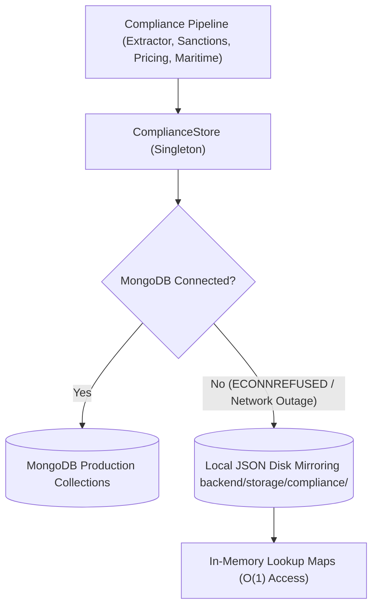

# TradeGuard Intelligence — Offline-First & Network Decoupling Guide

## 1. Architecture Philosophy

In enterprise trade finance compliance, network outages, upstream government website downtime, or rate-limiting must **never** prevent banks, customs brokers, or compliance officers from analyzing commercial trade transactions.

TradeGuard guarantees **100% offline-capable document analysis**:
- **Zero outbound HTTP calls** are executed during `TradeComplianceExtractor.processTradeDocument()`.
- All operational compliance decisions rely strictly on the canonical local store.

---

## 2. Dual-Tier Persistence Architecture

The canonical store (`ComplianceStore`) maintains an automatic dual-tier architecture:



### Disk Storage Layout
The local disk persistence directory is `backend/storage/compliance/`:
- `sources.json`: 9 registered data sources and their last sync run checksums.
- `entities.json`: Sanctioned entities with bitemporal dates.
- `price_benchmarks.json`: UN Comtrade benchmark corridors and HS codes.
- `vessels.json`: Merchant fleet IMO registrations, flags, and types.
- `ports.json`: UN/LOCODE port coordinates and aliases.
- `fx_rates.json`: Central bank currency conversion baselines.

---

## 3. Graceful Degradation Policies

The system classifies compliance dependencies into two operational tiers:

### Tier 1: Required Compliance Foundations (Never Degraded)
These components must always evaluate deterministically, even with zero network connectivity:
1. **Sanctions Point-in-Time Screening**: Evaluated against canonical local entities.
2. **Commodity Price Corridors**: Evaluated against official UN Comtrade benchmark corridors in local storage.
3. **FX Currency Normalization**: Converted using local central bank exchange rates.
4. **UN/LOCODE Port Verification**: Standardized using local geographical port database.
5. **9-Factor Compliance Risk Matrix**: All risk weighting and legal decision trees execute locally.

### Tier 2: Enrichment Networks (Non-Blocking Fallback)
For non-standard edge cases where an entity or vessel is missing from local canonical baseline:
- **Live Scrapers**: In-memory scrapers for external maritime AIS or customs websites are decoupled behind background sync or secondary fallback.
- **Enrichment Behavior**: If offline, the pipeline flags the item as `INSUFFICIENT_MARKET_DATA` or `ROUTE_DATA_UNAVAILABLE` with a clear explanation note, rather than throwing an exception or blocking document analysis.
- **Audit Logging**: The limitation is recorded in the document audit trail (`limitations` array) preserving full transparency for compliance officers.

---

## 4. Automated Offline Verification

To prove that the pipeline executes with zero network dependency, run:

```bash
cd backend
npx tsx scripts/test-offline-mode.ts
```

This verification suite:
1. Replaces `global.fetch` with a strict assertion error that fails if any outbound HTTP call is attempted.
2. Evaluates FX currency normalization across PKR, EUR, and USD.
3. Evaluates commodity pricing intelligence across apparel and fabrics.
4. Evaluates maritime route analysis across vessels and ports.
5. Executes an entire end-to-end trade presentation analysis and asserts `internetCallsAttempted === 0`.
